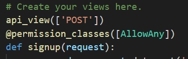

# 21.11.18 (목)


### 진행 과정

```
1. db를 각자의 컴퓨터에서 사용할 수 있도록 git hub에 올린다
 >> (csv 파일로 올라가있기 때문에 서로 pull 받아서 사용할 수 있음)

2. 회원가입 페이지 작성
>> csrf token, 403 forbidden 오류 발생 >> 해결하다가 안 되서 교수님께 물어보고 해결

3. 로그인 페이지 작성
로그인을 했지만 movieList.vue에서 created 함수를 불러오는데 오타로 인해 401 오류 발생 >> 오타 수정으로 해결 완료


++ 추가 작업
커뮤니티 페이지
리뷰, 댓글은 모델만 작성

디테일 페이지 작성
- 영화 제목을 누르면 해당 영화 디테일 불러 오기
```


### 어려웠던 점

```
1. sign up 페이지를 만들면서 csrf token 오류가 발생
vue에서는 회원가입이 잘 되었지만, django에서 문제가 발생한 것 같다
jwt를 settings.py에서 다 입력을 해주었지만 계속해서 csrf cookies not set 오류가 발생함. 그리고 403 forbidden이 뜸
```


```
오류 발생 원인
api_view에 @이가 사라짐...
@api_view 하니까 잘 작동이 됨
```





```
2. detail 페이지를 어떻게 구현할 것인가
- 제목을 눌렀을 때 해당하는 영화를 불러 오려면 해당 영화 id를 불러오기가 어려웠다
query를 사용해서 query: { movieId}를 작성하고 axios로 django에 요청을 보내서 불러오는데 성공했다
```

