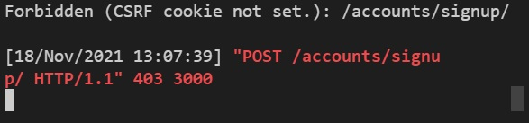

# 21.11.18 (목)


### 진행 과정

```

```


### 어려웠던 점

```
sign up 페이지를 만들면서 csrf token 오류가 발생
vue에서는 회원가입이 잘 되었지만, django에서 문제가 발생한 것 같다
jwt를 settings.py에서 다 입력을 해주었지만 계속해서 csrf cookies not set 오류가 발생함. 그리고 403 forbidden이 뜸
```




