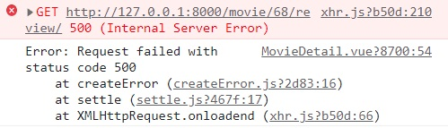
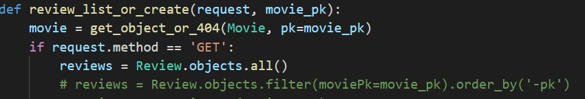
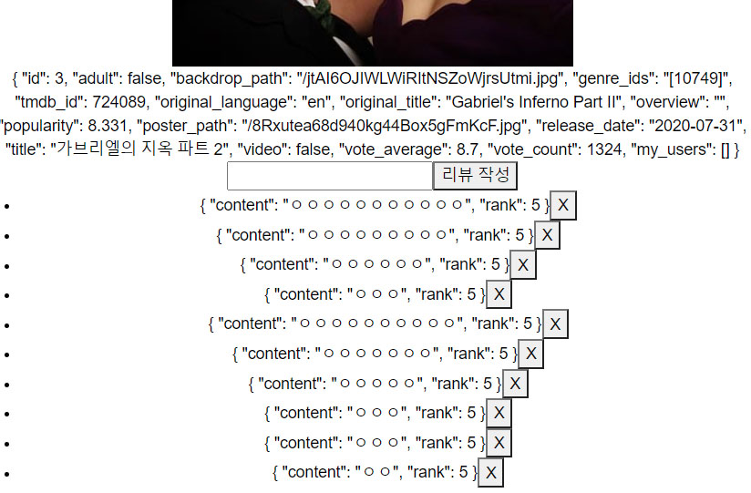
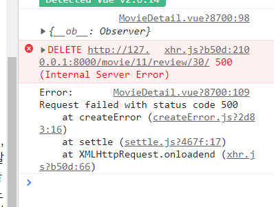

# 21.11.19 (금)


### 진행 과정

```
1. admin을 통해 관리자를 생성 후 계정 관리
- 모델을 작성해서 관리자 계정 생성 함

2. 디테일 페이지에서 리뷰를 작성하고 그 리뷰를 볼 수 있도록 생성
- 각각의 영화에 남긴 리뷰를 볼 수 있도록 모델과 view에 작성

3. 사용자들이 리뷰를 작성하고 삭제할 수 있도록 만들어 줌
```


### 오류 & 오류 해결 과정

``` 
리뷰를 디테일 페이지에 불러오는 과정에서 500 internal Server Error가 발생했다
data에 reviews를 null로 설정하면 보이지 않았지만, []로 하니 빈 리스트만 보였다
```





```
views.py에서기존 filter로 작성한 리뷰를 review = Review.objects.all()로 바꾸니 리뷰가 정상적으로 출력이 되었다.
하지만 review에 대한 불필요한 내용까지 전부 나와서 for문을 사용해 필요한 부분만 추출했다

+ 정상인 줄 알았는데 모든 페이지에서 같은 리뷰가 출력된다

review = Review.objects.filter(movie_id=movie_pk).order_by('-pk')로
수정하니까 원하는 대로 작동했다
```


> 리뷰 떨어져서 나오게


```vue
<div>
  <ul v-for="review in reviews" :key="review.id">
    <li>
      <span>{{ review }}</span>
      <button>X</button>
    </li>
  </ul>
</div>


-------------------------------------------
리뷰가 위의 사진 처럼 붙어서 한 줄로 나옴
```




```vue
<div>
  <ul>
      <li v-for="review in reviews" :key="review.id">
          <span>{{ review }}</span>
          <button>X</button>
      </li>
    </ul>
</div>


--------------------------------------------
li tag에 작성하니 각 한 줄씩 출력 됨
```


> 리뷰 삭제



```python
리뷰를 삭제하는데 삭제가 되지 않고 발생한 오류...

@api_view(['PUT', 'DELETE'])
@permission_classes([AllowAny])
def review_update_or_delete(request, review_pk):
    review = get_object_or_404(Review, pk=review_pk)

    if not request.user.review_set.filter(pk=review_pk).exist():
        return Response({'detail': '권한이 없습니다.'}, status=status.HTTP_403_FORBIDDEN)
    
    
__________________________________________
@api_view(['PUT', 'DELETE'])
@permission_classes([AllowAny])
def review_update_or_delete(request, movie_pk, review_pk):
    review = get_object_or_404(Review, pk=review_pk)

    if not request.user.review_set.filter(pk=review_pk).exists():
        return Response({'detail': '권한이 없습니다.'}, status=status.HTTP_403_FORBIDDEN)

    
 
>> def review_update_or_delete(request, movie_pk, review_pk):
    movie_pk 추가
>> .exist()
	.exists() s빠짐 오타
    
오류 해결 완료..
```

