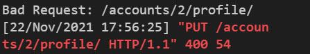

# 21.11.22 (월)


### 진행 과정

```
1. 팔로우 기능 구현
- 팔로우
- 팔로잉 보기
- 팔로워 보기


3. 별점(평점) 추가 기능
- 영화별로 평점을 추가할 수 있게 별점 추가(디자인)


4. 디자인
- logo 추가
- 디테일 페이지 디자인
- 메인페이지 이미지와 영화 제목 같이 나오게 만들어 줌
- 폰트 수정
```


### 오류 & 오류 해결 과정

> 로그인 405 오류


```
urlpatterns = [
    path('signup/', views.signup),
    path('profile/', views.my_profile),
    path('<nickname>/', views.profile),
    path('api-token-auth/', obtain_jwt_token),
]

--------------------------------------------------

urlpatterns = [
    path('api-token-auth/', obtain_jwt_token),
    path('signup/', views.signup),
    path('profile/', views.my_profile),
    path('<nickname>/', views.profile),
]


>>  path('api-token-auth/', obtain_jwt_token) 순서를 path('<nickname>/', views.profile) 위로 올려주니 정상 작동 되었다
```


> 프로필 페이지 정보 불러오는데 발생한 404 오류


```
urlpatterns = [
    path('api-token-auth/', obtain_jwt_token),
    path('signup/', views.signup),
    path('<username>/', views.login_info),
    python path('<int:user_pk>/', views.profile),
    path('profile/', views.my_profile),
]

-------------------------------------------
>> python path('<int:user_pk>/', views.profile)를 path('<int:user_pk>/profile/', views.profile)로 바꾸니까 정상 작동 됨(profile)추가
```


> 프로필 닉네임 수정이 안 됨



```
class UserProfileSerializer(serializers.ModelSerializer):

    class Meta:
        model = get_user_model()
        fields = '__all__'
        
--------------------------------------------------------
>> fields = ('nickname',)로 바꿔서 닉네임만 수정 가능하게하니 정상적으로 작동이 됐다
```


### 디자인 수정중

> 회원가입, 로그인, 로그아웃 페이지


> 프로필 페이지


> 영화 리스트 (메인 페이지)


> 디테일 페이지


