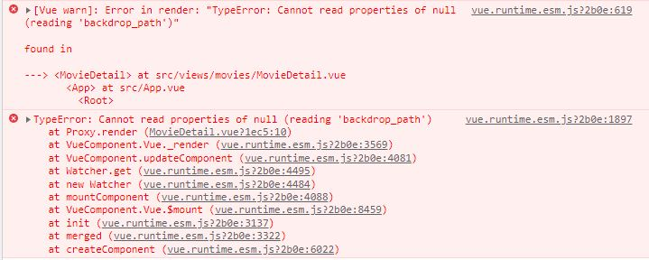
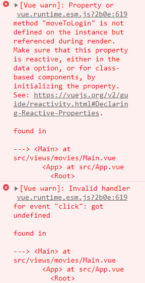

# 21.11.23 (화)


### 진행 과정

```
1. 디자인
- 네브바, 로고 전체 페이지에 출력 (색상 #d63384)
- 메인 페이지
- 로그인, 회원가입 폼 디자인
```


### 오류 & 오류 해결 과정

> 오류 오류



```
디테일 페이지에서 backdrop_path를 불러오는데 발생한 오류
이미지는 잘 나오지만 콘솔창에 빨간불이 들어 옴
```


> 로그인 버튼 생성 오류



```
export default {
  name: 'Main',
  method: {
    moveToLogin: function () {
      this.$router.push({
        name: 'Login'
      })
    }
  }
}

-----------------------------------------
method에 s 빠짐
 methods: {
    moveToLogin: function () {
      this.$router.push({
        name: 'Login'
      })
하니까 정상 작동
```

