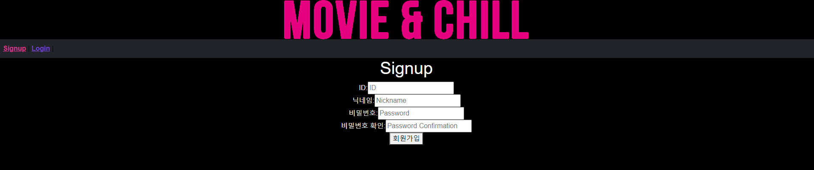

[TOC]

# PJT-FINAL

> ### 팀명 : 종기패스 (옹기종기)

🔔팀장 : 장원종

🔑팀원 : 문슬기


> 업무 분담 내역

BACK - 장원종

FRONT - 문슬기


>  개발 기간 
>
> 2021.11.17 - 2021.11.25


## 결과물

- 메인페이지


- 로그인 & 회원가입


- 영화 목록 페이지(메인)


- 영화 상세 정보 조회 페이지 (디테일 페이지)


- 디테일 페이지 - 리뷰 & 댓글


- 영화 추천 페이지


- user 프로필 페이지


## 개발 환경

1. 개발 스택
   - python
   - Django
   - HTML
   - CSS(SCSS)
   - JavaScript
   - Vue.js


## 목표

- 계획한 내용 전부 구현하기
- PJT 월말 평가 패스하기
- 배운 내용 최대한 활용하기


## Design Thinking

#### 디자인 참고 사이트

- 넷플릭스
- 왓챠
- 웨이브
- 디즈니플러스


#### 홈페이지 로고

- MOVIE & CHILL
- 넷플릭스 하면 Netfilx and chill이 생각이 나서 우리와 함께 영화 볼래?라는 뜻으로 네이밍


#### 디자인 컬러


## Web page prototype

- 메인페이지


- 디테일 페이지


- 회원가입, 로그아웃 페이지




- 프로필 페이지


- 리뷰 & 댓글


## ERD


- 주 모델 : 영화, 유저, 리뷰 , 댓글
  - 1:N 참조 관계: 영화-영화유저, 영화-리뷰, 영화-영화장르, 영화장르-장르, 영화유저-유저, 유저-댓글, 유저-리뷰, 댓글-리뷰


- 중개모델(M:N):
  - 유저-팔로우


- 유저 - 팔로우(워):
  - 영화 추천 알고리즘을 짜기 위해 생성한 관계
  - 유저끼리 팔로우, 팔로워를 통해 서로의 영화 리스트를 추천하도록 할 것


## BACK END / FRONT END

> BACK END 구조

- final_pjt(프로젝트)
- accounts(계정 앱)
- movies(영화 서비스 관련 앱)


> FRONT END 구조

- accounts(계정)
- movies(영화 서비스 관련)
- recommend(영화 추천 관련)


#### 관리자 뷰

- 장고에서 제공하는 admin 기능을 사용해서 관리자 생성
- 관리자는 유저를 관리하고, 유저가 등록한 댓글 / 리뷰 등의 삭제 수정 등록의 권한을 가짐


#### 영화 정보

- tmdb api를 사용해서 tmdb의 영화 목록을 받은 후 csv로 저장
- 반복문을 사용해서 1000개의 영화를 받아서 저장해줬다
- 저장한 csv를 sqlite를 통해 데이터에 반영해서 모든 페이지에서 활용


#### 추천알고리즘

- 홈페이지의 목적이 내 취향대로 영화를 골라 담아 나와 비슷한 취향의 진구들을 만날 수 있는 것
- 추천 알고리즘은 내가 담은 영화들을 함께 담고 있는 사람들을 추천해주는데, 내가 이미 팔로우 하고 있는 사람을 제외한 사람들만 추천해준다
- 인스타그램의 함께 아는 친구 기능 처럼 함께 좋아하는 영화가 몇 개인지를 보여준다


#### 커뮤니티

- 커뮤니티 페이지를 게시판 보다는 영화 디테일에서 바로 유저끼리 리뷰와 댓글을 남길 수 있도록 페이지를 생성
- 해당 영화 페이지에서 게시판을 가지 않고도 유저끼리 소통할 수 있다


# 프로젝트 진행 기간별 README

>  ### 노션을 활용해서 작업 목록, 하루 계획을 매일 작성


# 21.11.17 (수) - 프로젝트 시작

### 진행과정

```
🔥🔥🔥🔥🔥🔥🔥🔥🔥🔥 불타오르네 🔥🔥🔥🔥🔥🔥🔥🔥🔥🔥 뽜이어 🔥🔥🔥🔥🔥🔥🔥🔥🔥🔥

tmdb에서 영화 파일을 db에 담아주기 위해 json 파일로 저장하는 데 방법을 찾기가 어려웠다
그래서 곽머리씻김굿 팀과 교수님께 질문을 통해서 pjt02 파일의 tmdmhelper를 사용하면 된다는 점을 참고해서 작성함.

현재 영화 데이터 제이슨 파일은 만들었고 데이터 베이스에 저장하는 과정을 진행 중임


* tmdb api로 영화 조회
request_url = tmdb_helper.get_requuest_url(region='KR', language='ko')
print(request_url)
```


# 21.11.18 (목) D-7

### 진행 과정

```
1. db를 각자의 컴퓨터에서 사용할 수 있도록 git hub에 올린다
>> (csv 파일로 올라가있기 때문에 서로 pull 받아서 사용할 수 있음)

2. 회원가입 페이지 작성
>> csrf token, 403 forbidden 오류 발생 >> 해결하다가 안 돼서 교수님께 물어보고 해결

3. 로그인 페이지 작성
로그인을 했지만 movieList.vue에서 created 함수를 불러오는데 오타로 인해 401 오류 발생 >> 오타 수정으로 해결 완료


++ 추가 작업
커뮤니티 페이지
리뷰, 댓글은 모델만 작성

디테일 페이지 작성
- 영화 제목을 누르면 해당 영화 디테일 불러오기
```


### 어려웠던 점 (નાસ)

```
1. sign up 페이지를 만들면서 csrf token 오류가 발생
vue에서는 회원가입이 잘 되었지만, django에서 문제가 발생한 것 같다
jwt를 settings.py에서 다 입력을 해주었지만 계속해서 csrf cookies not set 오류가 발생함. 그리고 403 forbidden이 뜸
```


```
오류 발생 원인
api_view에 @이가 사라짐...
@api_view 하니까 잘 작동이 됨
```


```
2. detail 페이지를 어떻게 구현할 것인가
- 제목을 눌렀을 때 해당하는 영화를 불러오려면 해당 영화 id를 불러오기가 어려웠다
query를 사용해서 query: { movieId}를 작성하고 axios로 django에 요청을 보내서 불러오는데 성공했다
```


# 21.11.19 (금) D-6

### 진행 과정

```
1. admin을 통해 관리자를 생성 후 계정 관리
- 모델을 작성해서 관리자 계정 생성함

2. 디테일 페이지에서 리뷰를 작성하고 그 리뷰를 볼 수 있도록 생성
- 각각의 영화에 남긴 리뷰를 볼 수 있도록 모델과 view에 작성

3. 사용자들이 리뷰를 작성하고 삭제할 수 있도록 만들어 줌
```


### 오류 & 오류 해결 과정

``` 
리뷰를 디테일 페이지에 불러오는 과정에서 500 internal Server Error가 발생했다
data에 reviews를 null로 설정하면 보이지 않았지만, []로 하니 빈 리스트만 보였다
```


```
views.py에서 기존 filter로 작성한 리뷰를 review = Review.objects.all()로 바꾸니 리뷰가 정상적으로 출력이 되었다.
하지만 review에 대한 불필요한 내용까지 전부 나와서 for 문을 사용해 필요한 부분만 추출했다

+ 정상인 줄 알았는데 모든 페이지에서 같은 리뷰가 출력된다

review = Review.objects.filter(movie_id=movie_pk).order_by('-pk')로
수정하니까 원하는 대로 작동했다
```


> 리뷰 떨어져서 나오게


```vue
<div>
  <ul v-for="review in reviews" :key="review.id">
    <li>
      <span>{{ review }}</span>
      <button>X</button>
    </li>
  </ul>
</div>


-------------------------------------------
리뷰가 위의 사진처럼 붙어서 한 줄로 나옴
```


```vue
<div>
  <ul>
      <li v-for="review in reviews" :key="review.id">
          <span>{{ review }}</span>
          <button>X</button>
      </li>
    </ul>
</div>


--------------------------------------------
li tag에 작성하니 각 한 줄씩 출력 됨
```


> 리뷰 삭제


```python
리뷰를 삭제하는데 삭제가 되지 않고 발생한 오류...

@api_view(['PUT', 'DELETE'])
@permission_classes([AllowAny])
def review_update_or_delete(request, review_pk):
    review = get_object_or_404(Review, pk=review_pk)

    if not request.user.review_set.filter(pk=review_pk).exist():
        return Response({'detail': '권한이 없습니다.'}, status=status.HTTP_403_FORBIDDEN)
    
    
__________________________________________
@api_view(['PUT', 'DELETE'])
@permission_classes([AllowAny])
def review_update_or_delete(request, movie_pk, review_pk):
    review = get_object_or_404(Review, pk=review_pk)

    if not request.user.review_set.filter(pk=review_pk).exists():
        return Response({'detail': '권한이 없습니다.'}, status=status.HTTP_403_FORBIDDEN)

    
 
>> def review_update_or_delete(request, movie_pk, review_pk):
    movie_pk 추가
>> .exist()
	.exists() s 빠짐 오타
    
오류 해결 완료..
```


# 21. 11. 20 (토) D-5

### 진행 과정

```
1. 로그아웃 / 회원 탈퇴


2. 프로필 페이지 생성
- 닉네임 수정


추가할 것
- 비밀번호도 수정 가능한데 로그인 때처럼 confirm 어떻게 할지
- 회원 탈퇴 시 로그아웃 되게 했는데 App.vue에 isLogin 처리해야 함
```


# 21.11.21 (일) D-4

### 진행 과정

```
1. Search bar 생성
- 검색한 영화를 출력할 수 있도록 검색 창 생성


2. my movie에 내 영화 저장
- 내가 본 영화 db에 저장
- 프로필 페이지로 이동하면 어떤 영화를 저장했는지 볼 수 있도록
- 버튼 한 번 더 누르면 저장한 영화 없어지도록 구현
```


### 오류 & 오류 해결 과정

```
프로필 페이지에 정보들이 갑자기 출력되지 않음
```


```
class UserProfileSerializer(serializers.ModelSerializer):
    my_movies = MovieSerializer(many=True, read_only=True)  # 변수명 related_name(없다면 '★_set')과 같게 해줘야 함

    class Meta:
        model = get_user_model()
        fields = ('username', 'password', 'nickname', 'my_movies')


----------------------------------------------------
fields = ('username', 'password', 'nickname',)
'my_movies'를 없애니까 정상 작동함
```


# 21.11.22 (월) D-3

### 진행 과정

```
1. 팔로우 기능 구현
- 팔로우
- 팔로잉 보기
- 팔로워 보기


3. 별점(평점) 추가 기능
- 영화별로 평점을 추가할 수 있게 별점 추가(디자인)


4. 디자인
- logo 추가
- 디테일 페이지 디자인
- 메인 페이지 이미지와 영화 제목같이 나오게 만들어 줌
- 폰트 수정
```


### 오류 & 오류 해결 과정

> 로그인 405 오류


```
urlpatterns = [
    path('signup/', views.signup),
    path('profile/', views.my_profile),
    path('<nickname>/', views.profile),
    path('api-token-auth/', obtain_jwt_token),
]

--------------------------------------------------

urlpatterns = [
    path('api-token-auth/', obtain_jwt_token),
    path('signup/', views.signup),
    path('profile/', views.my_profile),
    path('<nickname>/', views.profile),
]


>>  path('api-token-auth/', obtain_jwt_token) 순서를 path('<nickname>/', views.profile) 위로 올려주니 정상 작동되었다
```


> 프로필 페이지 정보 불러오는데 발생한 404 오류


```
urlpatterns = [
    path('api-token-auth/', obtain_jwt_token),
    path('signup/', views.signup),
    path('<username>/', views.login_info),
    python path('<int:user_pk>/', views.profile),
    path('profile/', views.my_profile),
]

-------------------------------------------
>> python path('<int:user_pk>/', views.profile)를 path('<int:user_pk>/profile/', views.profile)로 바꾸니까 정상 작동됨(profile) 추가
```


> 프로필 닉네임 수정이 안 됨


```
class UserProfileSerializer(serializers.ModelSerializer):

    class Meta:
        model = get_user_model()
        fields = '__all__'
        
--------------------------------------------------------
>> fields = ('nickname',)로 바꿔서 닉네임만 수정 가능하게 하니 정상적으로 작동이 됐다
```


# 21.11.23 (화) D-2

### 진행 과정

```
1. 디자인
- 네브바, 로고 전체 페이지에 출력 (색상 #d63384)
- 메인 페이지
- 로그인, 회원가입 폼 디자인
```


### 오류 & 오류 해결 과정

> 디테일 배경 오류


```
디테일 페이지에서 backdrop_path를 불러오는데 발생한 오류
이미지는 잘 나오지만 콘솔 창에 빨간불이 들어옴
```


> 로그인 버튼 생성 오류


```
export default {
  name: 'Main',
  method: {
    moveToLogin: function () {
      this.$router.push({
        name: 'Login'
      })
    }
  }
}

-----------------------------------------
method에 s 빠짐
 methods: {
    moveToLogin: function () {
      this.$router.push({
        name: 'Login'
      })
하니까 정상 작동
```


# 21.11.24 (수) D-1

### 진행 과정

```
* 디자인 (로고 색상 #e4007f)


1. 커뮤니티 기능(리뷰, 댓글)
- 리뷰를 좀 더 예쁘게 꾸며줌


2. 추천 페이지 
- 프로필에서 저장한 영화를 기반으로 추천 기능 구현


3. 프로필 페이지
- 해당 유저의 프로필을 카드 형식으로 작성
```


### 어려웠던 점 (CSS IS AWESOME)

```
* MovieList
디테일 페이지에 영화 목록들을 중간 배치하는 부분이 어려웠다
마진을 주는 등 여러 가지 방법을 했지만.. 중간으로 오지 않음

>> 스타일 주는 class에서
left 가 먹혀 있어서 mx-auto로 해도 중간으로 오지 않음
left를 지우고 mx-auto를 주니 중앙으로 배치가 됨


* 리뷰
리뷰 디자인을 수정하는 게... 어려워요...
입력된 리뷰와 댓글을 연결하는 게 어려움...
𝙒𝙝𝙮𝙧𝙖𝙣𝙤... 𝙒𝙝𝙮𝙧𝙖𝙣𝙤... 𝙒𝙝𝙮𝙧𝙖𝙣𝙤... 𝙒𝙝𝙮𝙧𝙖𝙣𝙤... 𝙒𝙝𝙮𝙧𝙖𝙣𝙤... 𝙒𝙝𝙮𝙧𝙖𝙣𝙤...


* 프로필 페이지
프로필 카드를 작성하면서 문제 발견
기존 무비 카드에 반영된 card.css 파일의 디자인이 프로필 카드에 반영됨
profile.vue 파일의 style에 옮겨서 css 적용시킴
```


# 21.11.25 (목) D-day 프로젝트 제출

### 진행 과정

```
최종 디자인 수정 & 디버깅

1. 댓글 반복해서 뜨는 거 해결
2. 버튼, 입력창, 배경 부분 최종 수정
```


# 프로젝트를 마치며


> 문슬기 (역시🤔내가🧒귀여운💞탓인가🤦‍♀️), 장원종 (나는🌸귀여우니깐🌟다괜찮아🍬)

```
일주일간의 프로젝트가 드디어 끝났다!
처음 만들어보는 프로젝트라서 많이 걱정을 했는데 페어를 잘 만난 덕분에 무사히 프로젝트를 완성할 수 있었다
이걸 2학기에는 계속한다는 건가..?


서로에 대한 신뢰를 기반으로 프로젝트를 진행
온라인으로 소통하다 보니 의사를 전달하는 데 한계가 있었지만, 공용 노션을 사용하거나, 화면 공유, 그림판을 활용해서 어떻게 진행할 것인지 알기 쉽게 보여주면서 온라인의 한계를 극복해 나갔다


배운 내용을 써먹는데도 초반에 배웠던 css를 적용하려고 하니 중구난방으로 움직여서 애먹었다. 정말 손으로 그려서 붙이고 싶은 심정
404. 400, 403, 401, 500 오류는 정말 많이 봤다. 오타로 인한 오류가 발생하고 교수님이 찾아 줬을 때의 허무함과 민망함😂😂


프로젝트 시작 시 오로지 평가를 패스만 할 목적을 가지고 시작했는데 프로젝트를 진행하다 보니 내가 나타내고자 한 대로 코드를 짜고 그 결과를 눈으로 바로 보니까 재밌었다. 그러다 가 더 잘 만들고 싶은 욕심이 생겨서 어떻게 하면 더 많은 기능을 구현할 수 있을지, 사용자의 관점에서 보기 좋게 꾸밀 수 있는지를 고민하면서 다양한 참고 자료를 수집했다. 이를 바탕으로 우리 코드에 직접 적용하고 발생한 오류를 수정해 나가면서 배울 수 있었던 좋은 경험이 되었다. 또 완성된 프로젝트를 보니 성취감을 느낄 수 있었다. 다른 프로젝트를 진행하더라도 이번에 했던 경험을 살려서 좋은 결과를 낼 수 있을 것이라는 자신감이 생긴다. 그리고 더 발전한 모습을 보여 수 있다는 것에 기대가 된다.
```


